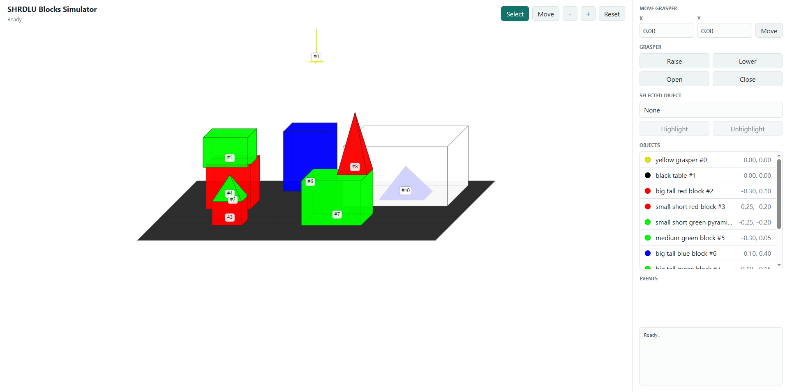

# SHRDLU Block World

Small standalone tabletop blocks-world simulator. It can run as a Python object,
a headless HTTP service, or a browser viewer for manual control.

## Install

```bash
pip install shrdlu-block-world
```

For local development:

```bash
cd ~/shrdlu-block-world
python -m pip install -e .
```

## Run

```bash
# Browser viewer at http://127.0.0.1:18123/
python3 -m shrdlu_blocks.simulator

# API only
python3 -m shrdlu_blocks.simulator --headless
```

Useful options:

- `--host HOST`
- `--port PORT`
- `--open-browser`

## Interface

Running `python3 -m shrdlu_blocks.simulator` starts a small browser UI for
manual control of the scene.



The viewer includes:

- a central canvas showing the current blocks-world scene
- `Select` and `Move` modes for interacting with objects in the canvas
- zoom controls and a reset button in the top bar
- direct `x` and `y` inputs for `move_grasper`
- buttons for `raise_grasper`, `lower_grasper`, `open_grasper`, and `close_grasper`
- an object list for selecting the active object
- highlight and unhighlight controls for the selected object
- an event log showing recent actions and simulator responses

This UI is served from the same HTTP server as the JSON API, so the browser
viewer and programmatic API stay in sync.

## Python API

```python
from shrdlu_blocks import ShrdluBlocksEnv

env = ShrdluBlocksEnv()
env.execute_action({"name": "move_grasper", "args": {"x": -0.1, "y": 0.4}})
env.execute_action({"name": "lower_grasper", "args": {}})
print(env.snapshot_text())
```

## HTTP API

- `GET /api/state`
- `POST /api/action`
- `POST /api/reset`

`POST /api/action` expects an action object:

```json
{
  "action": {
    "name": "move_grasper",
    "args": {"x": -0.1, "y": 0.4}
  }
}
```

Supported action names:

- `move_grasper` with `x` and `y`
- `lower_grasper`
- `raise_grasper`
- `close_grasper`
- `open_grasper`
- `highlight_object`
- `unhighlight_object`

## Configuration

```bash
export SHRDLU_SIMULATOR_HOST=0.0.0.0
export SHRDLU_SIMULATOR_PORT=18123
export SHRDLU_WEB_OPEN_BROWSER=1
```

For remote use, forward the viewer port and open `http://localhost:18123`:

```bash
ssh -L 18123:localhost:18123 user@remote-host
```

## Layout

- `shrdlu_blocks/simulator/`: environment, controller, scene model, and HTTP server
- `shrdlu_blocks/viewer/`: browser viewer and static assets
- `shrdlu_blocks/client.py`: small HTTP client for a running service
